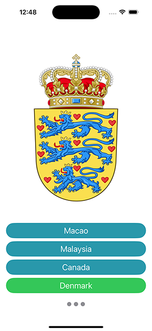

# Coat of Arms • MVVM

This is an small iOS app meant to be a study on MVVM-C architecture with SwiftUI.

Some focus points are:
- View hierarchy
- Unidirectional Data Flow
- Single Source of Truth
- Screenshot testing
- View Styling
- ViewModel factories
- Decouple of Networking and Storage layer